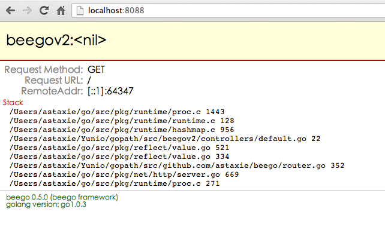

# Выпуск и развертывание

### Режим разработки

Приложение созданное `bee` в режиме разработки по умолчанию.

Мы можем изменить режим следующим образом:

	beego.RunMode = "prod"

Или изменив это в файле conf/app.conf:

	runmode = prod

В режиме разработчика:

- Если вы не имеете папку 'views', вы увидите следующую ошибку:

		2013/04/13 19:36:17 [W] [stat views: no such file or directory]

- Шаблоны никогда не будут загружены в кеш.

- Если будет ошибки на сервере, в браузере будет следующий вид:

###  Выпуск и развертывание

Приложение на Go представляет собой байт-код файл после компиляции. Вы просто должны скопировать этот файл на серере и запустить его. Beego включает статические файлы, файлы конфигурации и шаблоны, таким образом эти три папки также должны быть скопированы на сервере во время развертывания.

	$ mkdir /opt/app/beepkg
	$ cp beepkg /opt/app/beepkg
	$ cp -fr views /opt/app/beepkg
	$ cp -fr static /opt/app/beepkg
	$ cp -fr conf /opt/app/beepkg

Здесь структура папок `/opt/app/beepkg`:

	.
	├── conf
	│   ├── app.conf
	├── static
	│   ├── css
	│   ├── img
	│   └── js
	└── views
	    └── index.tpl
	├── beepkg

Теперь мы должны скопировать наше приложение на северер. Следующий шаг развернуть его.

Есть два способа запустить его:

- [Stand alone deploy](./beego.md)
- [Deploy with Supervisord ](./supervisor.md)
	
Приложение будет открыто выше, обычно мы имеет nginx или apache на серере и балансировщик нагрузки для нашего приложения.

- [Deploy with Nginx](./nginx.md)
- [Deploy with Apache](./apache.md)
